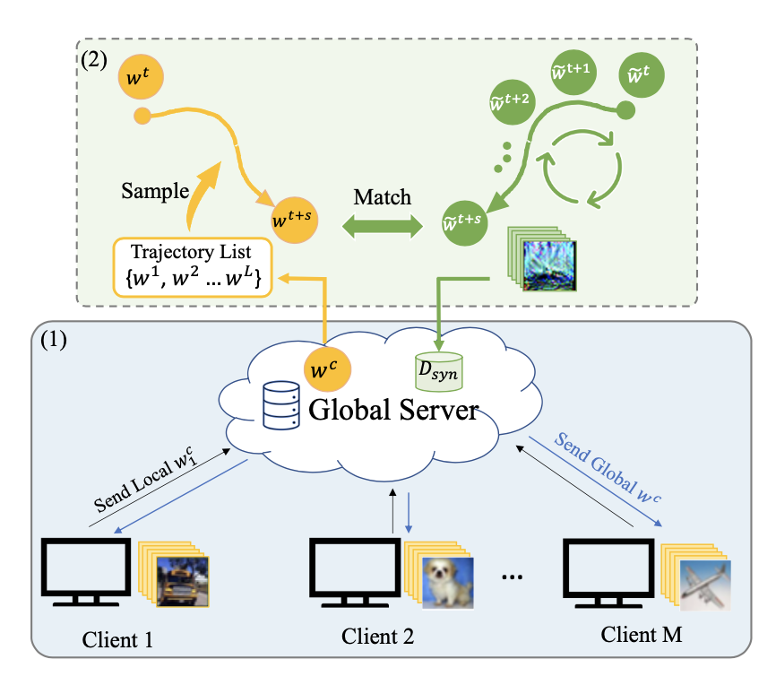
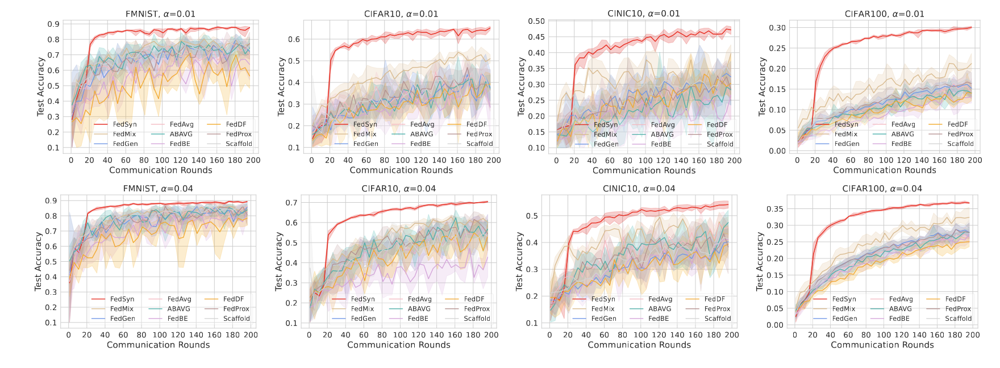
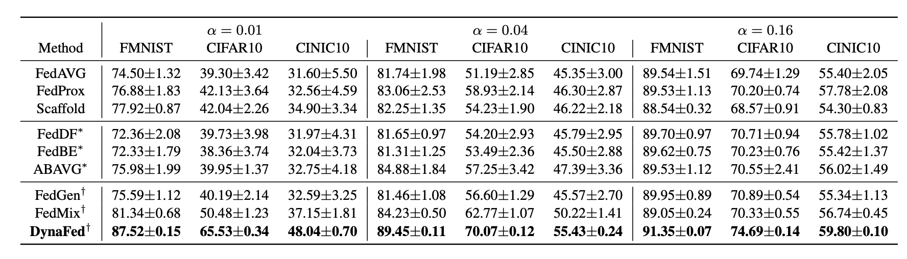

# DYNAFED: Tackling Client Data Heterogeneity with Global Dynamics


This repository contains the source code for the paper DYNAFED: Tackling Client Data Heterogeneity with Global Dynamics.
 Our paper is available on arXiv: [link](https://arxiv.org/abs/2211.10878).

## Table of Contents

- [Installation](#installation)
- [Reproducing Results](#reproducing-results)
- [Citation](#citation)

## Installation
To use this project, you will need to install the following packages:

- PyTorch: `pip install torch`
- wandb: `pip install wandb`
- scikit-learn: `pip install scikit-learn`

## Reproducing Results

To reproduce the results from our paper, follow these steps:

1. Download the datasets (fmnist, cifar, cinic10).
2. Train the model by running the following commands:

```
# cifar10 experiments
bash experiments/cifar10/cifar10_0.01_serverdistill.sh
# cifar100 experiments
bash experiments/cifar100/cifar100_0.01_serverdistill.sh
# cinic10 experiments
bash experiments/cinic10/cinic10_0.01_serverdistill.sh

```

### Example Results




### Credits

We would like to give credit to the following repositories for their code and resources that we used in our project:

- [Dataset Distillation by Matching Training Trajectories
](https://github.com/GeorgeCazenavette/mtt-distillation) - we were inspired from the source code for distilling data from expert trajectories.

## Citation

If you use our code or data in your research, please cite our paper. You can use the following BibTeX entry:
```bibtex
@article{pi2022dynafed,
  title={DYNAFED: Tackling Client Data Heterogeneity with Global Dynamics},
  author={Pi, Renjie and Zhang, Weizhong and Xie, Yueqi and Gao, Jiahui and Wang, Xiaoyu and Kim, Sunghun and Chen, Qifeng},
  journal={arXiv preprint arXiv:2211.10878},
  year={2022}
}
